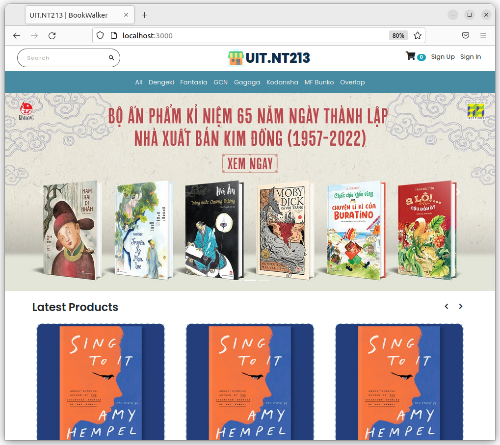

  

<h2 align="center">UIT.NT213 Books Store </h2>

<h4 align="center">A room without books is like a body without a soul.</h4>

A responsive ecommerce website using NodeJS, ExpressJS, and MongoDB.

  
  
  

## ToC

  - [Preview](#preview)
  - [Preparation](#preparation)
  - [Technology](#technology)
  - [Features](#features)
  - [Database](#database)
    - [User Schema](#user-schema)
    - [Category Schema](#category-schema)
    - [Product Schema](#product-schema)
    - [Cart Schema](#cart-schema)
    - [Order Schema](#order-schema)
  - [Find me around the web](#find-me-around-the-web)

## Preview

The website resembles a real store and you can add products to your cart and pay for them. If you want to try the checkout process, you can use the dummy card number provided by stripe for testing which is `4242 4242 4242 4242` with any expiration date, CVC, and zip codes. Please **DO NOT** provide real card number and data.

In order to access the admin panel on `/admin` you need to provide the admin **email** and **password**.

## Preparation

To run this application, you have to set your own environmental variables. For security reasons, some variables have been hidden from view and used as environmental variables with the help of `dotenv` package. Below are the variables that you need to set in order to run the application:

- **MONGO_URI**: *this is the connection string of your MongoDB Atlas database.*

- **SESSION_SECRET**: *a secret message for the session. You can use any string here.*

- **STRIPE_PRIVATE_KEY**: *the stripe package is used to process payment in the checkout route. To get this, you should set up a stripe account and put your private API key here.*

- **GMAIL_EMAIL, GMAIL_PASSWORD**: *the email and password given to nodemailer to send/receive the email. Please put a real email and password here because you will receive the messages sent from the contact us form on this email.*

- **ADMIN_EMAIL**, **ADMIN_PASSWORD**: *the email and password used to log into the admin panel using **AdminBro**. You can put any email and password here.*

- **ADMIN_COOKIE_NAME**, **ADMIN_COOKIE_PASSWORD**: *the cookie name and password used in the **AdminBro** authentication method. You can put any strings here.*

After you've set these environmental variables in the `.env` file at the root of the project, you need to navigate to the **seedDB** folder and run `node category-seed.js` and `node products-seed.js` to fill your empty **MongoDB Atlas database**.

Now you can run `npm start` in the terminal and the application should work.

## Technology

The application is built with:

- **NodeJS** *version 12.16.3*
- **MongoDB** *version 4.2.0*
- **Express** *version 4.16.1*
- **Bootstrap** *version 4.4.1*
- **FontAwesome** *version 5.13.0*
- **Stripe API** v3: *used for payment in the checkout page*
- **Mapbox**: *used to show the map in the about us page*
- **AdminBro**: *used and customized to implement the admin panel*
- **Nodemailer**: *used to send emails from the contact us form*
- **Passport**: *used for authentication*
- **Express Validator**: *used for form validation*

## Features

The application displays a virtual bags store that contains virtual products and contact information.

#### Users can do the following:

- Create an account, login or logout
- Browse available products added by the admin
- Add products to the shopping cart
- Delete products from the shopping cart
- Display the shopping cart
- To checkout, a user must be logged in
- Checkout information is processed using stripe and the payment is send to the admin
- The profile contains all the orders a user has made

#### Admins can do the following:

- Login or logout to the admin panel
- View all the information stored in the database. They can view/add/edit/delete orders, users, products and categories. The cart model cannot be modified by an admin because a cart is either modified by the logged in user before the purchase or deleted after the purchase.

## Database

All the models can be found in the models directory created using `mongoose`.

#### User Schema

- **username** (*String*)
- **email** (*String*)
- **password** (*String*)

#### Category Schema

- **title** (*String*)
- **slug** (*String*)

#### Product Schema

- **productCode** (*String*)
- **title** (*String*)
- **imagePath** (*String*)
- **description** (*String*)
- **price** (*Number*)
- **category** (*ObjectId - a reference to the category schema*)
- **manufacturer** (*String*)
- **available** (*Boolean*)
- **createdAt** (*Date*)

#### Cart Schema

- **items**: *an array of objects, each object contains.*
  - **productId** (*ObjectId - a reference to the product schema*)
  - **qty** (*Number*)
  - **price** (*Number*)
  - **title** (*String*)
  - **productCode** (*Number*)
- **totalQty** (*Number*)
- **totalCost** (*Number*)
- **user** (*ObjectId - a reference to the user schema*)
- **createdAt**

---  
**Note.** *The reason for including the title, price, and productCode again in the items object is AdminBro. If we are to write our own admin interface, we can remove them and instead populate a product field using the product id. However, AdminBro doesn't populate deep levels, so we had to repeat these fields in the items array in order to display them in the admin panel.*

---
### Order Schema:

- **user** (*ObjectId - a reference to the user schema*)
- **cart** (*instead of a reference, we had to structure an object identical to the cart schema because of AdminBro, so we can display the cart's contents in the admin interface under each order*)
- **address** (*String*)
- **paymentId** (*String*)
- **createdAt** (*Date*)
- **Delivered** (*Boolean*)

### Find me around the web

- Information in public on <a href="https://meoki.net/">**Blog**</a> 
- Sharing updates on <a href="https://facebook.com/slytherinnn/">**Facebook**</a>
- Other products on <a href="https://www.behance.net/meokisama">**Behance**</a>
- Daily photos on <a href="https://www.instagram.com/meokisama/">**Instagram**</a>
- "Wibu" collection on <a href="https://www.flickr.com/photos/meokisama/albums">**Flickr**</a>